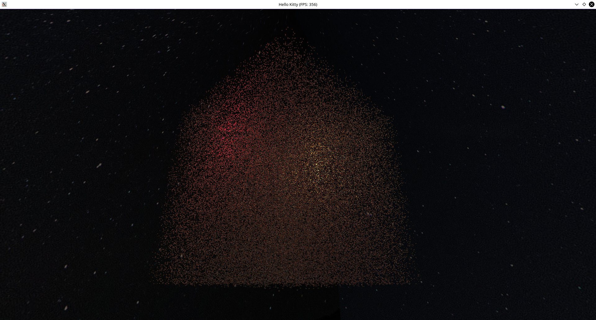

#  KittyEngine
This is my attempt at making a sensible abstraction layer for Vulkan as well as a simpler interface interacting with that layer to make things even easier. We'll see how this goes...

OK, so I should probably put some useful information here about features and stuff. So:

## Features

* Textures and objects (.obj files only).
* 128 dynamic lights. If you want more you need to recompile the shader as well as the library (or ask me very nicely to recompile the shader for you.)
* Instanced objects.

### Instancing demo:

100,000 Phong shaded, textured (512x512) boxes.

### 

_350 FPS with NVIDIA GTX 970 at 1920x1000 (not 1080, because windowed)._

##

### Credits

I loosely followed Alexander Overvoorde's tutorial over at https://vulkan-tutorial.com/ while setting up the basics and it was super helpful!

https://github.com/SaschaWillems/Vulkan for amazing tutorials!
